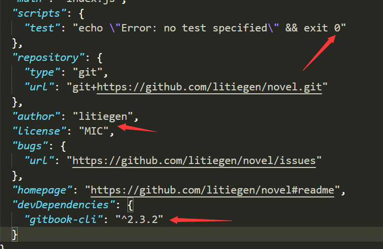

# Gitbook

npm i -g gitbook-cli
gitbook --version
gitbook build
git checkout -b gh-pages
git branch -r
git branch -a
git branch -D gh-pages
git push origin gh-pages
git checkout master

"devDependencies": {
    "gitbook-cli": "^2.3.2"
  }
USER_NAME litiegen
USER_EMAIL 517206296@qq.com
ACC_TOKEN github配置
BRANCH gh-pages
GH_REF github.com/litiegen/novel

git credential-manager remove | uninstall 本地git用户
git config --global credential.helper wincred 全部git用户删除